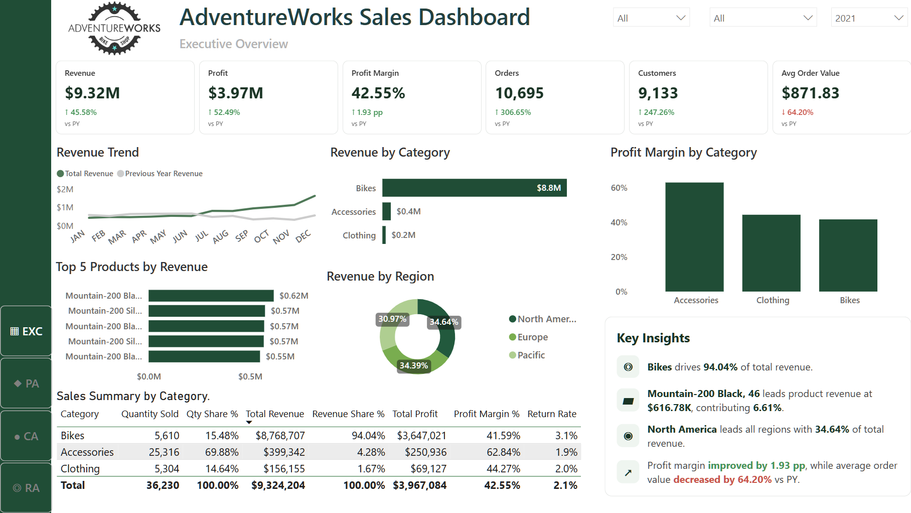
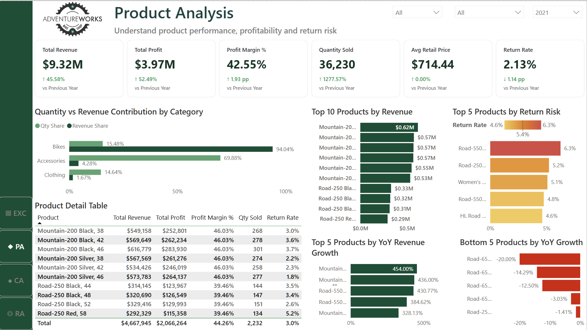
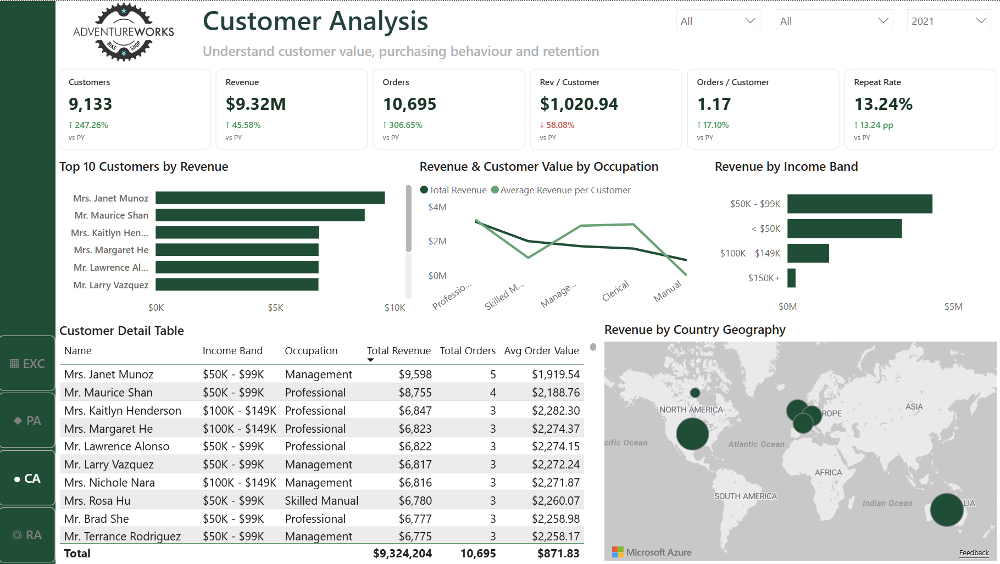
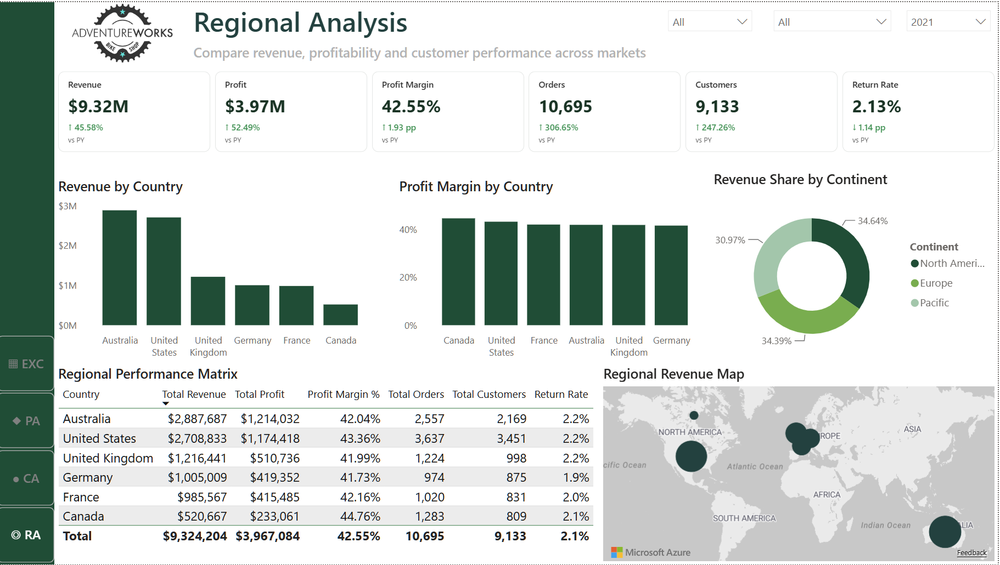

# AdventureWorks Retail Analytics

## Project Overview

A retail sales case study using BigQuery and Power BI to assess growth, product mix, profitability and customer purchasing behaviour. The analysis covers 2020, 2021 and January–June 2022, with four dashboard pages for executive, product, customer and regional analysis.

The repository includes five SQL analysis files, a Power BI report, model and measure documentation, dashboard exports and recorded findings.

## Key Findings

Across the available sales period, unless a year is specified:

- **Revenue grew approximately 45.6% in 2021 versus 2020.** The executive dashboard reports $9.32M in 2021 revenue.
- **Bikes dominate sales value:** approximately $23.64M, or 94.89% of revenue, from 16.55% of units sold. Accessories account for 68.68% of units but only 3.64% of revenue. Revenue performance therefore depends heavily on the bike category.
- **Customer value varies by occupation:** Professional customers generated approximately $8.47M and averaged $1,622.18 per active customer. Management customers averaged $1,589.87, compared with $1,083.11 for Manual customers.

See [key findings](results/key_findings.md) for the recorded results and scope notes.

## Dashboard

Download the [Power BI report](powerbi/AdventureWorks_Retail_Analytics.pbix) to explore the analysis. Screenshots show the filters selected at export; their figures may differ from findings covering the full available period.

### Executive Overview

Revenue, profit, margin, orders, customers and average order value, with sales trends and category performance.



### Product Analysis

Category and product contribution, profitability and returns.



### Customer Analysis

Customer activity, repeat purchasing and customer value by demographic group.



### Regional Analysis

Sales performance across territories, countries and continents.



## Business Questions

- How do revenue, profit, orders and average order value change over time?
- Which categories and products drive sales value, unit volume and profit?
- Which products have the highest return volume?
- What share of active customers place more than one order, and how does customer value vary by occupation?
- How does sales performance differ across regions?

### Metric Definitions

Metrics use the selected period and dashboard filters. Sales are recorded at order-line grain (`OrderNumber` + `OrderLineItem`).

| Metric | Definition |
|---|---|
| Revenue | Sum of `ProductPrice × OrderQuantity` across sales lines |
| Cost | Sum of `ProductCost × OrderQuantity` across sales lines |
| Profit | `Revenue - Cost` |
| Profit Margin % | `Profit / Revenue × 100` |
| Orders | Distinct count of `OrderNumber` |
| Average Order Value (AOV) | `Revenue / distinct OrderNumber` |
| Active Customers | Distinct count of `CustomerKey` with sales in the selected period |
| Repeat Customers | Active customers with more than one distinct `OrderNumber` in the selected period |
| Repeat Customer Rate % | `Repeat Customers / Active Customers × 100` |
| Units Sold | Sum of `OrderQuantity` |
| Returned Units | Sum of `ReturnQuantity` |

Repeat Customer Rate measures repeat purchasing within a period. It does not measure customer retention across periods.

## Tools

- **Google BigQuery and GoogleSQL:** data validation, exploration and business analysis.
- **Power BI:** data model and interactive dashboards.
- **Power Query:** data preparation for the report.
- **DAX:** revenue, profitability, order and customer measures.

## Analysis Workflow

1. Combined the annual sales extracts into `sales_data` and excluded non-customer footer rows from the customer source.
2. Checked date coverage, order-line duplicates, missing values and order quantities.
3. Profiled monthly activity, product mix, purchasing frequency and returns.
4. Analysed sales growth, product profitability and customer value in BigQuery.
5. Connected sales and returns to shared dimensions in Power BI and calculated the documented measures.
6. Presented the analysis in four dashboard pages and documented the findings and limitations.

## SQL Analysis

| File | Analysis |
|---|---|
| [Data Validation](sql/01_data_validation.sql) | Coverage, order-line grain, completeness and quantity checks |
| [Data Exploration](sql/02_data_exploration.sql) | Monthly activity, product mix, customer purchasing and returns |
| [Sales Performance](sql/03_sales_performance.sql) | Sales KPIs, profitability, monthly trends and comparable-period growth |
| [Product Analysis](sql/04_product_analysis.sql) | Category and product contribution, profitability and returned units |
| [Customer Analysis](sql/05_customer_analysis.sql) | Purchase frequency, repeat customers, top customers and occupation groups |

Queries use GoogleSQL and reference the `adventureworks` BigQuery dataset. See the [data dictionary](data/data_dictionary.md) for fields and relationships.

## Power BI Model

Sales and returns connect to shared product, territory and calendar dimensions. Sales also connect to customers; products connect through subcategories to categories.

- [Power BI report](powerbi/AdventureWorks_Retail_Analytics.pbix)
- [Data model and relationship diagram](powerbi/data_model.md)
- [DAX measures](powerbi/dax_measures.md)

## Data Limitations

- **2022 covers January–June only.** Any 2022 YoY comparison must compare January–June 2022 with January–June 2021. Full-year 2021 totals are not a comparable baseline.
- Revenue and cost use product lookup prices and costs multiplied by sales quantities. They do not incorporate transaction-specific discounts or historical price changes.
- Revenue and profit are not net of returns. Returns are analysed separately as returned units; the returns table does not identify an original order or customer.
- Profit represents revenue less product cost, without operating expenses.
- Repeat purchasing depends on the observation window and selected filters. It should not be interpreted as a retention or lifetime-value measure.
- Figures describe the AdventureWorks sample dataset rather than a live retailer.

## Repository Structure

```text
adventureworks-retail-analytics/
├── README.md
├── data/
│   └── data_dictionary.md
├── sql/
│   ├── 01_data_validation.sql
│   ├── 02_data_exploration.sql
│   ├── 03_sales_performance.sql
│   ├── 04_product_analysis.sql
│   └── 05_customer_analysis.sql
├── powerbi/
│   ├── AdventureWorks_Retail_Analytics.pbix
│   ├── data_model.md
│   └── dax_measures.md
├── results/
│   └── key_findings.md
└── images/
    ├── executive_overview.png
    ├── product_analysis.png
    ├── customer_analysis.png
    ├── regional_analysis.png
    └── data_model.png
```
