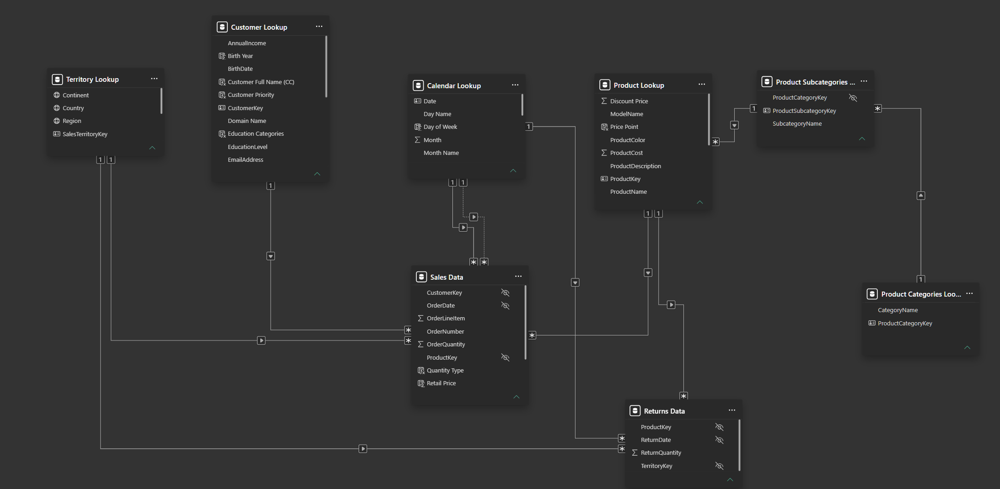

# Power BI Data Model

The Power BI model uses a star-schema-style structure with sales and returns data connected to shared dimension tables.

## Model Structure

### Fact Tables

**Sales Data**
- OrderDate
- StockDate
- OrderNumber
- ProductKey
- CustomerKey
- TerritoryKey
- OrderLineItem
- OrderQuantity

**Returns Data**
- ReturnDate
- TerritoryKey
- ProductKey
- ReturnQuantity

### Dimension Tables

**Product Lookup**
- Product information, price and cost
- Linked to Product Subcategories

**Product Subcategories Lookup**
- Product subcategory information
- Linked to Product Categories

**Product Categories Lookup**
- Product category information

**Customer Lookup**
- Customer demographic and profile attributes

**Territory Lookup**
- Region, country and continent

**Calendar Lookup**
- Shared date dimension used for time-based analysis

## Key Relationships

| From | To | Relationship |
|---|---|---|
| Sales Data | Product Lookup | ProductKey |
| Sales Data | Customer Lookup | CustomerKey |
| Sales Data | Territory Lookup | TerritoryKey → SalesTerritoryKey |
| Sales Data | Calendar Lookup | OrderDate → Date |
| Product Lookup | Product Subcategories Lookup | ProductSubcategoryKey |
| Product Subcategories Lookup | Product Categories Lookup | ProductCategoryKey |
| Returns Data | Product Lookup | ProductKey |
| Returns Data | Territory Lookup | TerritoryKey → SalesTerritoryKey |
| Returns Data | Calendar Lookup | ReturnDate → Date |

## Modelling Approach

The model separates transactional data from descriptive dimensions so that sales, product and customer measures can be analysed consistently across dashboard pages.

The Calendar table provides the common time dimension for monthly and year-over-year analysis.

Sales data covers 2020, 2021 and January–June 2022. Any 2022 YoY comparison must use January–June 2022 against January–June 2021. Full-year 2021 totals are not a comparable baseline.

Revenue and cost sum `ProductPrice × OrderQuantity` and `ProductCost × OrderQuantity` across sales lines. Profit is revenue less product cost. Returns are analysed separately and do not reduce these sales measures. See [metric definitions and limitations](../README.md#metric-definitions) and the [DAX measures](dax_measures.md).

## Model View

